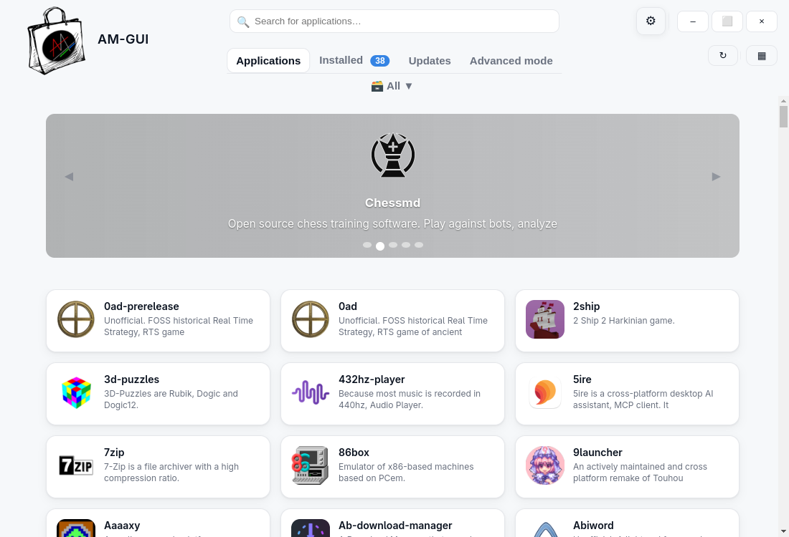

<div align="center">
  
  <h1 align="center">AM-GUI</h1>
  <p align="center">A simple graphical frontend to easily install, update, and manage AppImages and other portable formats on Linux, powered by <a href="https://github.com/ivan-hc/AM">AM</a>.</p>
  
[](https://github.com/Shikakiben/AM-GUI/releases/latest)
[](https://github.com/Shikakiben/AM-GUI/releases)
[](https://github.com/Shikakiben/AM-GUI/releases)
[](https://github.com/Shikakiben/AM-GUI/releases/latest)

<br>
  
  

</div>
<br>
<br>
<br>

  
* [Latest Release](https://github.com/Shikakiben/AM-GUI/releases/latest)  (AppImage — Beta)

**This AppImage bundles everything and should work on any linux distro, even on musl based ones.**

Thanks to [Samueru-sama](https://github.com/Samueru-sama) and [fiftydinar](https://github.com/fiftydinar) for making AppImage builds quicker and easier with this [TEMPLATE](https://github.com/pkgforge-dev/TEMPLATE-AppImage) using the [Anylinux-AppImages](https://github.com/pkgforge-dev/Anylinux-AppImages) tools.

---

If you already have [AM](https://github.com/ivan-hc/AM): use `am -i am-gui` or `appman -i am-gui` (depending on your configuration).

If not, download the [Latest Release](https://github.com/Shikakiben/AM-GUI/releases/latest) and follow the installation steps.  
To integrate AM-GUI into your system, reinstall it via the app (search "am-gui") and you may remove the downloaded release afterward.
<br>
<br>

---

⚠️ **This project is under development — some features may be incomplete or may not work.**  

Please don't hesitate to report issues [here](https://github.com/Shikakiben/AM-GUI/issues) — your feedback is very helpful!

  **All credit goes to [Ivan](https://github.com/ivan-hc) for his amazing work! I only handle the GUI, learning how to properly yell at GPT-4.1 to make sure that little f$@¤=# doesn't mess too much with the code.**
   
---


## Development installation

- Requirements:

  [Node.js](https://nodejs.org/) (>=20, 22 recommended)

If it's not available in your package manager, see: https://nodejs.org/en/download

You may also need to install the following build tools:

*Debian/Ubuntu*:
   ```bash
   sudo apt install build-essential python3 make gcc g++
   ```
*Fedora*:
   ```bash
   sudo dnf install @development-tools python3
   ```


- Clone the repository and install:

```bash
git clone https://github.com/Shikakiben/AM-GUI.git
cd AM-GUI
npm install
npx electron-rebuild
```


- Launch the app:

```bash
npm start
```


---


## Acknowledgements

Thanks to [Ivan](https://github.com/ivan-hc), [Samueru-sama](https://github.com/Samueru-sama) and all the [pkgforge community](https://github.com/pkgforge-dev) for their outstanding work building, managing and distributing AppImages and other portable formats on Linux.


---

## License

This project is licensed under the **GNU General Public License v3.0 (GPLv3)**.

See the LICENSE file for details.
